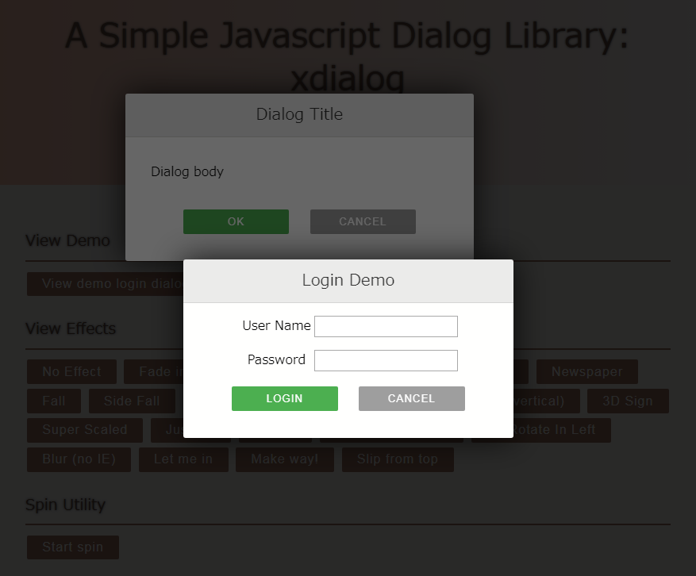

# xdialog: A simple and beautiful JavaScript dialog library

xdialog is a simple JavaScript library to create beautiful modern dialogs with lots of cool effects using CSS3 transitions and transforms.

Online demo is here [xdialog demo](https://xxjapp.github.io/xdialog/)



## Background

Inspired by codrops' [ModalWindowEffects](https://github.com/codrops/ModalWindowEffects), this dialog library enhanced some of the original CSS effects.

## How to use it

- Download xdialog library js and css files from [release page](https://github.com/xxjapp/xdialog/releases/latest).
- Insert the Stylesheet **xdialog.min.css** and JavaScript **xdialog.min.js** into the html file. Insert development non-min files if you like.

```html
<link rel="stylesheet" href="xdialog/xdialog.min.css" />
<script src="xdialog/xdialog.min.js"></script>
```

- Call xdialog API to open or create dialogs, like the following

```js
let dialog1 = xdialog.open();   // open is a shortcut of create + show
dialog1.close();                // close is a shortcut of hide + destroy

let dialog2 = xdialog.create({title: 'Hello dialog'});
dialog2.show();
dialog2.hide();
dialog2.destroy();
```

## Reference

### default options

Default options will be used if you **create** / **open** dialog without corresponding attributes. You can overwrite these with your own values.

```js
{
    // dialog title
    // use null value to remove title
    title: 'Dialog Title',

    // dialog body
    // use null value to remove body
    body: '<p>Dialog body</p>',

    // dialog buttons,
    //
    // valid values:
    // - array
    //  - predefined button name or user defined button html like
    //  ['ok', 'cancel', 'delete', '<button id="my-button-id" class="my-button-class">Button-text</button>']
    // - object
    //  - button name to button text(predefined) or button html(user defined) or attribute object map like
    // {
    //     ok: {
    //         name: '削除',
    //         style: 'background:#f44336;'
    //         clazz: 'xd-button xd-ok demo-copy-button'
    //     },
    //     delete: '削除',
    //     cancel: 'キャンセル',
    //     other: '<button id="my-button-id" class="my-button-class">Button-text</button>'
    // }
    buttons: ['ok', 'cancel'],

    // dialog extra style
    // for example 'width: auto;'
    style: '',

    // dialog show/hide effect, one of the following values
    // - fade_in_and_scale
    // - slide_in_right
    // - slide_in_bottom
    // - newspaper
    // - fall
    // - side_fall
    // - sticky_up
    // - 3d_flip_horizontal
    // - 3d_flip_vertical
    // - 3d_sign
    // - super_scaled
    // - just_me
    // - 3d_slit
    // - 3d_rotate_bottom
    // - 3d_rotate_in_left
    // - blur
    // - let_me_in
    // - make_way
    // - slip_from_top
    //
    // use '' or null value to disable effect
    effect: 'fade_in_and_scale',

    // fix dialog blur for chrome browser with/without transform and/or with/without perspective
    //
    // true: to fix
    // false: not to fix
    //
    fixChromeBlur: true,

    // modal or not
    modal: true,

    // callback before show
    beforeshow: null,

    // callback after show
    aftershow: null,

    // callback when OK button pressed
    // return false to avoid to be closed
    onok: null,

    // callback when Cancel button pressed
    // return false to avoid to be closed
    oncancel: null,

    // callback when Delete button pressed
    // return false to avoid to be closed
    ondelete: null,

    // callback when dialog is about to be destroyed
    // return false to avoid to be destroyed
    ondestroy: null,
}
```

### xdialog API

#### xdialog methods

- xdialog.init(options)

    ```text
    initialize xdialog
    options.zIndex0 - initial z index to use, default value is 10000
    ```

- xdialog.create(options)

    ```text
    create a dialog
    ```

    SEE: [default options](#default-options)

- xdialog.open(options)

    ```text
    create a dialog and show it
    ```

    SEE: [default options](#default-options)

- xdialog.alert(text, options)

    ```text
    display an alert dialog, please view the source for details
    ```

- xdialog.confirm(text, onyes, options)

    ```text
    display a confirm dialog, please view the source for details
    ```

- xdialog.dialogs()

    ```text
    get all dialog instances
    ```

#### xdialog utility methods

- xdialog.startSpin()

    ```text
    start spin animation
    ```

- xdialog.stopSpin()

    ```text
    stop spin animation
    ```

### dialog API

#### dialog attributes

- dialog.id

    ```text
    dialog html element id
    ```

- dialog.element

    ```text
    dialog html element
    ```

#### dialog methods

- dialog.show()

    ```text
    show dialog
    ```

- dialog.hide()

    ```text
    hide dialog
    ```

- dialog.destroy()

    ```text
    destroy dialog
    ```

- dialog.close()

    ```text
    hide dialog and destory it
    ```

- dialog.adjust()

    ```text
    adjust dialog to make the whole dialog visible
    ```

- dialog.fixChromeBlur()

    ```text
    fix chrome blur
    ```
