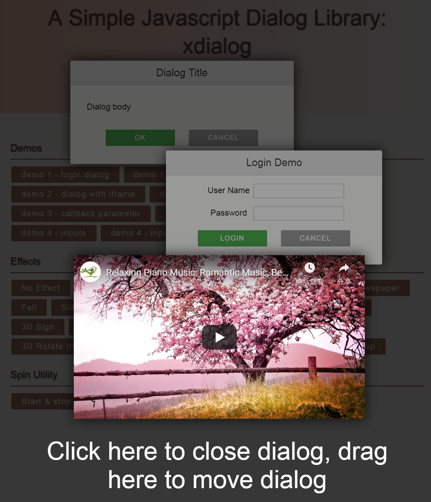

# xdialog: A simple and beautiful JavaScript dialog library

<a href="https://github.com/xxjapp/xdialog/releases/latest"></a> [](https://www.jsdelivr.com/package/gh/xxjapp/xdialog)

xdialog is a simple JavaScript library to create beautiful modern dialogs with lots of cool effects using CSS3 transitions and transforms.

Online demo is here [xdialog demo](https://xxjapp.github.io/xdialog/)



## Main features of xdialog

- Using vanilla JavaScript and CSS
- No dependency
- Modern and beautiful default UI
- Simple usage
- Lots of cool open/close effects
- Lots of options and callbacks can be used to customize easily
- Enter key to ok
- ESC key to cancel
- Click overlay to cancel
- Drag dialog/overlay to move dialog
- Supports iframe content such as YouTube videos

## Background

Inspired by codrops' [ModalWindowEffects](https://github.com/codrops/ModalWindowEffects), this dialog library enhanced some of the original CSS effects, and added many convenient functions.

## Installation

You can use CDN or local method to install.

1. CDN

    Insert the following code into your html file.

    ```html
    <link rel="stylesheet" href="https://cdn.jsdelivr.net/gh/xxjapp/xdialog@3/xdialog.min.css">
    <script src="https://cdn.jsdelivr.net/gh/xxjapp/xdialog@3/xdialog.min.js"></script>
    ```

    Or for non-min version, use this.

    ```html
    <link rel="stylesheet" href="https://cdn.jsdelivr.net/gh/xxjapp/xdialog@3/xdialog.css">
    <script src="https://cdn.jsdelivr.net/gh/xxjapp/xdialog@3/xdialog.js"></script>
    ```

    Thanks to [jsdelivr](https://www.jsdelivr.com), jsdelivr CDN works like magic. For more details, please refer [https://www.jsdelivr.com/package/gh/xxjapp/xdialog](https://www.jsdelivr.com/package/gh/xxjapp/xdialog).

2. Local

    - Download xdialog library file xdialog.x.y.z.min.zip or xdialog.x.y.z.zip from [release page](https://github.com/xxjapp/xdialog/releases/latest) and unzip it.
    - Insert the Stylesheet **xdialog.min.css** and JavaScript **xdialog.min.js** into the html file.

    ```html
    <link rel="stylesheet" href="path/to/xdialog.min.css">
    <script src="path/to/xdialog.min.js"></script>
    ```

    Or insert non-min version files if you like.

    ```html
    <link rel="stylesheet" href="path/to/xdialog.css">
    <script src="path/to/xdialog.js"></script>
    ```

## Usage

Just call xdialog API to open or create dialogs, like the following. See [Reference](#reference) for more details.

```js
let dialog1 = xdialog.open();   // open is a shortcut of create + show
dialog1.close();                // close is a shortcut of hide + destroy

let dialog2 = xdialog.create({title: 'Hello, xdialog', body: 'This is a message.'});
dialog2.show();
dialog2.hide();
dialog2.destroy();
```

## Reference

### xdialog API

#### xdialog methods

- xdialog.init(options)

    ```text
    initialize xdialog
    options.zIndex0 - initial z index to use, default value is 10000
    ```

- xdialog.create(options)

    ```text
    create a dialog
    ```

    SEE: [default options](#default-options)

- xdialog.open(options)

    ```text
    create a dialog and show it
    ```

    SEE: [default options](#default-options)

- xdialog.alert(text, options)

    ```text
    display an alert dialog, please view the source for details
    ```

- xdialog.confirm(text, onyes, options)

    ```text
    display a confirm dialog, please view the source for details
    ```

- xdialog.info(text, options)

    ```text
    display an information dialog, please view the source for details
    ```

- xdialog.warn(text, options)

    ```text
    display a warning dialog, please view the source for details
    ```

- xdialog.error(text, options)

    ```text
    display an error dialog, please view the source for details
    ```

- xdialog.fatal(text, options)

    ```text
    display a fatal error dialog, please view the source for details
    ```

- xdialog.dialogs()

    ```text
    get all dialog instances
    ```

#### xdialog utility methods

- xdialog.startSpin()

    ```text
    start spin animation
    ```

- xdialog.stopSpin()

    ```text
    stop spin animation
    ```

### dialog API

#### dialog attributes

- dialog.id

    ```text
    dialog html element id
    ```

- dialog.element

    ```text
    dialog html element
    ```

#### dialog methods

- dialog.show()

    ```text
    show dialog
    ```

- dialog.hide()

    ```text
    hide dialog
    ```

- dialog.destroy()

    ```text
    destroy dialog
    ```

- dialog.close()

    ```text
    hide dialog and destroy it
    ```

- dialog.adjust()

    ```text
    adjust dialog to make the whole dialog visible
    ```

- dialog.fixChromeBlur()

    ```text
    fix chrome blur
    ```

### default options

Default options will be used if you **create** / **open** dialog without corresponding attributes. You can overwrite these with your own values.

```js
{
    // dialog title
    // use null value to remove title
    title: 'Dialog Title',

    // dialog body
    //
    // valid values:
    // - null
    //      no body
    //
    // - string
    //      body html
    //
    // - object
    //      src: body source selector
    //      element: body source dom element
    //
    //      please use element when selector not usable
    //
    //      example:
    //      {
    //          src: '#demo6-content'
    //          element: document.getElementById('demo6-content')
    //      }
    body: '<p>Dialog body</p>',

    // dialog buttons
    //
    // valid values:
    // - null
    //      no buttons
    //
    // - array
    //      predefined button name or user defined button html like
    //      example: ['ok', 'cancel', 'delete', '<button id="my-button-id" class="my-button-class">Button-text</button>']
    //
    // - object
    //      button name to button text(predefined) or button html(user defined) or attribute object map like
    //      example: {
    //          ok: {
    //              text: 'okay',
    //              style: 'background:#4336f4;',
    //              clazz: 'xd-button xd-ok demo-copy-button'
    //          },
    //          delete: 'Delete',
    //          cancel: 'Cancel',
    //          other: '<button id="my-button-id" class="my-button-class">Button-text</button>'
    //      }
    buttons: ['ok', 'cancel'],

    // dialog extra classes
    // for example 'xd-fatal my-dialog-class'
    extraClass: '',

    // dialog extra style
    // for example 'width: 640px;'
    style: '',

    // dialog show/hide effect, one of the following values
    // - fade_in_and_scale
    // - slide_in_right
    // - slide_in_bottom
    // - newspaper
    // - fall
    // - side_fall
    // - sticky_up
    // - 3d_flip_horizontal
    // - 3d_flip_vertical
    // - 3d_sign
    // - super_scaled
    // - just_me
    // - 3d_slit
    // - 3d_rotate_bottom
    // - 3d_rotate_in_left
    // - blur
    // - let_me_in
    // - make_way
    // - slip_from_top
    //
    // use '' or null value to disable effect
    effect: 'fade_in_and_scale',

    // fix dialog blur for chrome browser with/without transform and/or with/without perspective
    //
    // true: to fix
    // false: not to fix
    //
    fixChromeBlur: true,

    // modal or not
    modal: true,

    // timeout in seconds to close dialog automatically
    // use 0 value to disable closing dialog automatically
    timeout: 0,

    // listen enter key press or not
    listenEnterKey: true,

    // listen ESC key press or not
    listenESCKey: true,

    // callback when dialog element is about to be created
    // return false to stop creating process
    beforecreate: null,

    // callback when dialog element has been created
    aftercreate: null,

    // callback before show
    // return false to stop showing process
    beforeshow: null,

    // callback after show
    aftershow: null,

    // callback before hide
    // return false to stop hidding process
    beforehide: null,

    // callback after hide
    afterhide: null,

    // callback when OK button pressed
    // return false to avoid to be closed
    onok: null,

    // callback when Cancel button pressed
    // return false to avoid to be closed
    oncancel: null,

    // callback when Delete button pressed
    // return false to avoid to be closed
    ondelete: null,

    // callback when dialog is about to be destroyed
    // return false to avoid to be destroyed
    ondestroy: null,

    // callback when drag will start
    // return false to avoid being dragged by default process
    // return true to allow being dragged
    // otherwise to go default process
    ondrag: null,
}
```

### callback function format

#### default

All callback functions use the same prototype, except the ones with special instruction.

```js
/**
 * @param {Object}  param           - callback parameter
 * @param {String}  param.id        - dialog html element id
 * @param {Element} param.element   - dialog html element
 * @param {Object}  param.dialog    - dialog instance
 * @param {Element} param.overlay   - dialog overlay element
 * @param {Event}   param.event     - event if any
 */
function callback(param)
```

#### callback for ondrag

```js
/**
 * @param {Element} element         - element clicked
 * @param {Element} destElement     - element to be moved
 * @param {Element} srcElement      - element to drag on
 */
function ondrag(element, destElement, srcElement)
```

Example: let jquery Sortable to handle some element's dragging.

SEE: [https://jqueryui.com/sortable/](https://jqueryui.com/sortable/)

```js
ondrag: function(element) {
    if ($(element).closest('.ui-sortable').length > 0) {
        return false;
    }

    // otherwise let go default process
}
```
